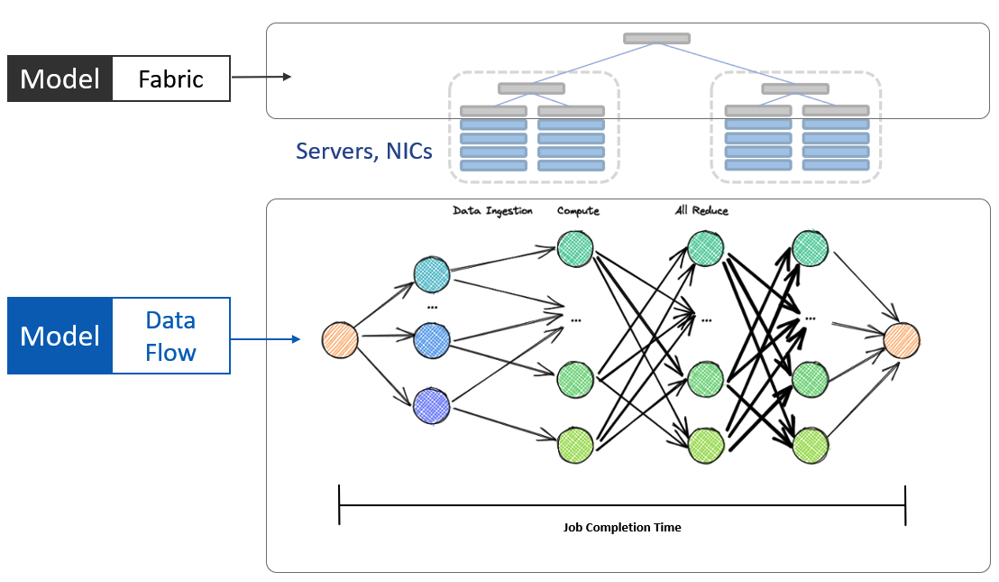
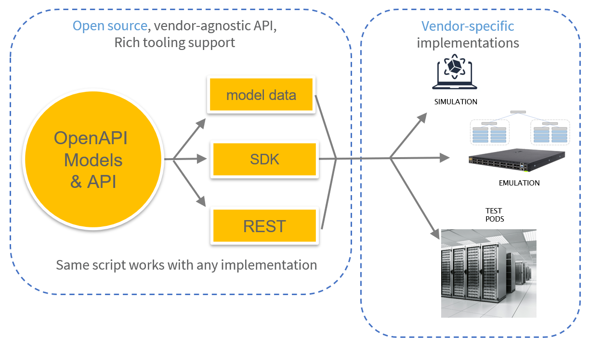

# Open Network Experiments `ONEx`

`ONEx` mission is to simplify the process of experimenting with distributed systems by proposing a set of standardized models and APIs for Fabric configuration, Data Flow and Chaos Engineering

Imagine an environment to experiment easily with different Data Center fabric configurations without learning a NOS, and replicating a complex communication pattern like for example a distributed machine learning training job without having to become an expert at ML

Imagine running 1000s of such experiments over night with different fabric, workload and transport settings and different packet loss or buffer load impairments

Automated, repeatable, experiments with distributed systems made easy with `ONEx`

Define the experiment once, run agains multiple implementations

[API and Data Models Repository](https://github.com/open-network-experiments/models)
